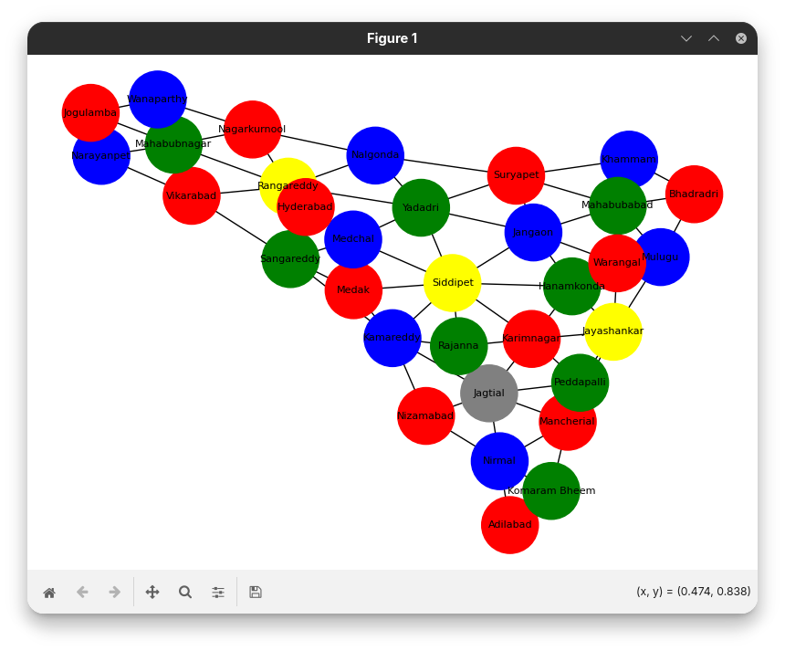
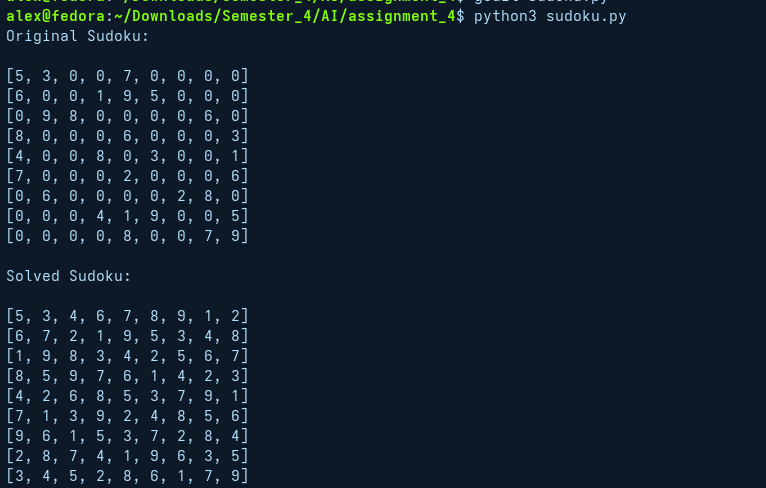
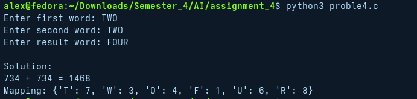

# 📘 Artificial Intelligence Lab – CSP Problems

## Name: Rishi  
## Subject: AI Lab  
## Topic: Constraint Satisfaction Problems (CSP)

---

##  Overview

This project implements different **Constraint Satisfaction Problems (CSP)** using Python.

A CSP consists of:
- **Variables**
- **Domains**
- **Constraints**

The goal is to assign values to variables such that **all constraints are satisfied**.

---

## Question 1: Map Coloring (Australia)

### Problem
Color the map of Australia such that no two adjacent states share the same color.

### CSP Formulation
- **Variables:** WA, NT, SA, Q, NSW, V, T  
- **Domain:** {Red, Green, Blue}  
- **Constraints:** Neighboring states must have different colors  

### Approach
- Implemented using **Backtracking Algorithm**
- Checked constraints before assigning colors

### Output Screenshot


---

##  Question 2: Map Coloring (Telangana – 33 Districts)

###  Problem
Apply map coloring to the 33 districts of Telangana.

### CSP Formulation
- **Variables:** 33 districts  
- **Domain:** {Red, Green, Blue, Yellow}  
- **Constraints:** Adjacent districts must not have the same color  

###  Approach
- Used **Backtracking**
- Defined adjacency relationships manually
- Visualized graph using **NetworkX (optional)**

###  Output Screenshot


---

##  Question 3: Sudoku Solver

###  Problem
Solve a standard 9×9 Sudoku puzzle.

###  CSP Formulation
- **Variables:** Each cell  
- **Domain:** {1–9}  
- **Constraints:**
  - Unique in each row
  - Unique in each column
  - Unique in each 3×3 subgrid  

###  Approach
- Solved using **Backtracking**
- Checked validity before placing each number

###  Output Screenshot


---

##  Question 4: Cryptarithmetic Problem

###  CSP Formulation
- **Variables:** T, W, O, F, U, R  
- **Domain:** {0–9}  
- **Constraints:**
  - All digits must be unique  
  - Leading digits cannot be zero  
  - Equation must satisfy arithmetic correctness  

###  Approach
- Used **itertools permutations**
- Checked all valid assignments

###  Output Screenshot


---

##  Tools Used

- Python 3  
- itertools  
- networkx (optional)  
- matplotlib (optional)  

---

##  How to Run

```bash
python filename.py